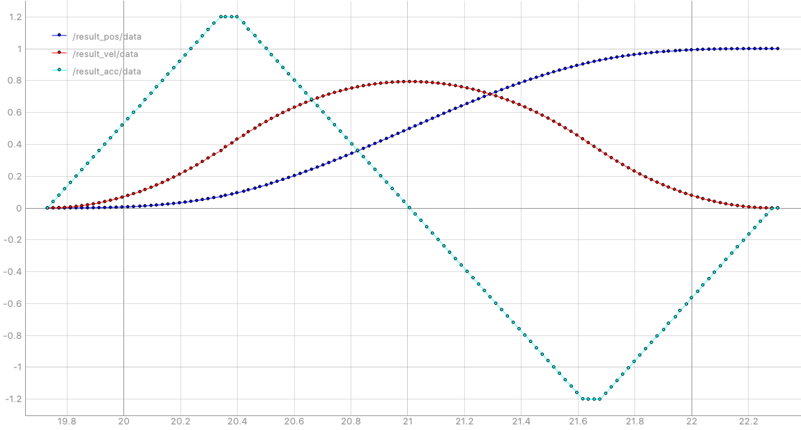
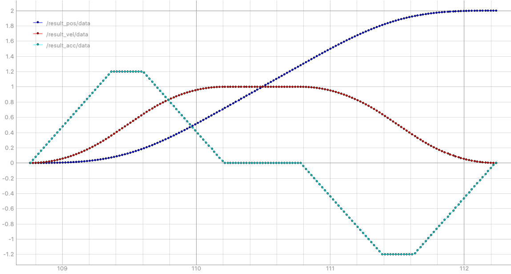
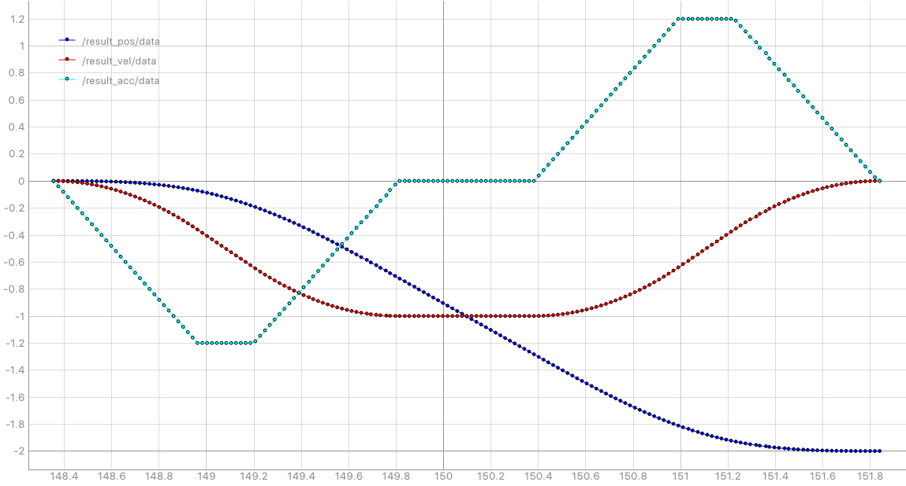
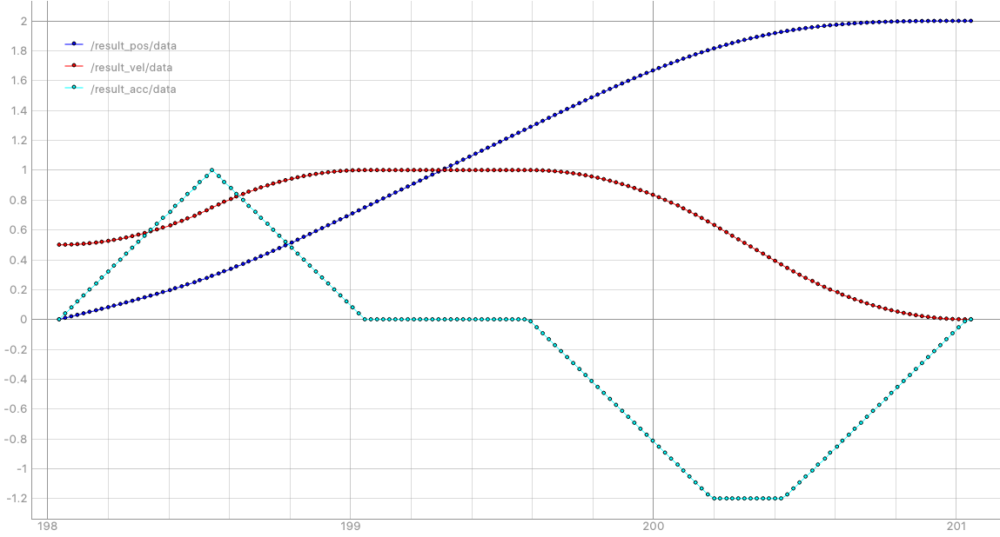
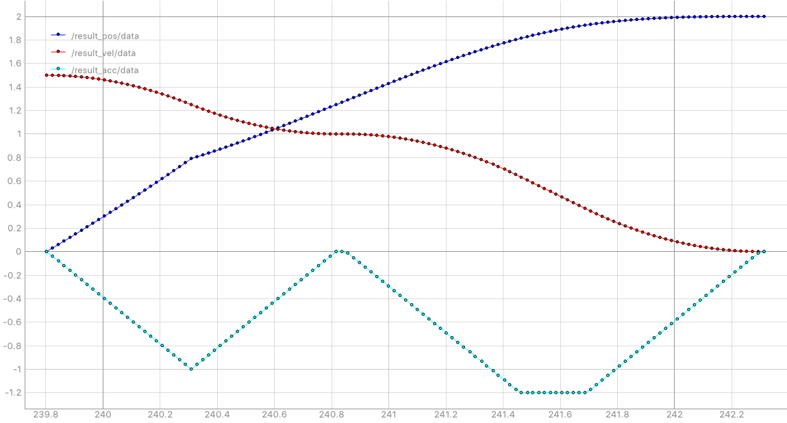

# s_velocity_profile_generator

The ROS package for Generating 1-D S Curved Velocity Profile

## Installl

```
$ cd ~/catkin_ws
$ git clone https://github.com/byeongkyu/s_velocity_profile_generator.git
$ catkin build

```

## Usage

```cpp
#include <s_velocity_profile_generator/s_velocity_profile_generator.h>

...

SVelocityProfileGenerator m;

// q0: start position
// q1: target position
// v0: velocity at start
// v1: velocity at target
// v_max: maximum velocity (m/s)
// a_max: maximum acceleration (m/s^2)
// j_max: maximum jerk (m/s^3)

m.generate_trajectory(q0, q1, v0, v1, v_max, a_max, j_max);

double a;
double v;
double p;
double t;

m.get_accel_at(t, a);
m.get_velocity_at(t, v);
m.get_position_at(t, p);
```

## Examples
- q0=0.0, q1=1.0,  v0=0.0, v1=0.0, v_max=1.0, a_max=1.2, j_max=2.0

- q0=0.0, q1=2.0,  v0=0.0, v1=0.0, v_max=1.0, a_max=1.2, j_max=2.0

- q0=0.0, q1=-2.0, v0=0.0, v1=0.0, v_max=1.0, a_max=1.2, j_max=2.0

- q0=0.0, q1=2.0,  v0=0.5, v1=0.0, v_max=1.0, a_max=1.2, j_max=2.0

- q0=0.0, q1=2.0,  v0=1.5, v1=0.0, v_max=1.0, a_max=1.2, j_max=2.0

